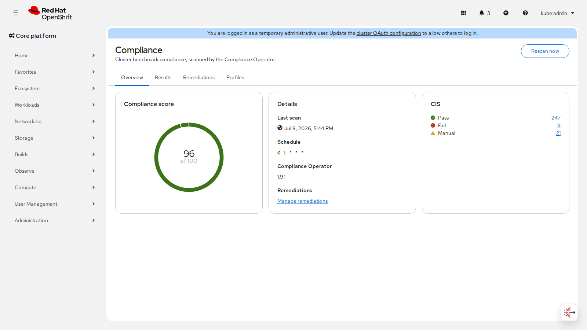

# OpenShift Baseline Security

Baseline compliance scanning for a single OpenShift cluster, built on the
Red Hat Compliance Operator, with results in the admin console.

Install it and the cluster benchmarks itself against the CIS OpenShift
Benchmark out of the box (PCI-DSS, NIST 800-53, DISA STIG, NERC CIP,
ACSC E8, and BSI selectable per profile), rendered natively in the console
under **Administration → Compliance**: score, filterable check results,
gated remediation apply, score trend.

- `docs/SPEC.md`: design specification (read this first)
- `docs/PATTERNS.md`: OpenShift addon patterns this repo follows
- `docs/STANDARDS.md`: coding standards reference with authoritative links
- `operator/`: Go operator (kubebuilder go/v4) reconciling the
  `ClusterBaseline` CRD: installs/adopts the Compliance Operator, owns
  ScanSetting/ScanSettingBinding defaults, deploys the console plugin,
  aggregates score + history into status
- `console-plugin/`: console dynamic plugin (React 18, PatternFly 6,
  dynamic-plugin-sdk 4.22)

## Screenshots

Live against a single-node OpenShift 4.22.0 cluster (CIS profile):




## Prerequisites

- OpenShift 4.22
- A default StorageClass (scan results are stored on a PVC; without one,
  scans hang and the operator reports a `Degraded` condition)
- Cluster access to an OLM catalog carrying `compliance-operator`
  (`redhat-operators` by default)

## Install (OLM)

Build and push the three images plus bundle and file-based catalog, then:

```sh
cd operator
make docker-build docker-push          # operator image
make bundle bundle-build bundle-push   # validated OLM bundle
make catalog-build && docker push $(CATALOG_IMG)
oc apply -f - <<EOF
apiVersion: operators.coreos.com/v1alpha1
kind: CatalogSource
metadata:
  name: baseline-security
  namespace: openshift-marketplace
spec:
  displayName: Baseline Security
  sourceType: grpc
  image: <CATALOG_IMG>
EOF
```

Then install "Baseline Security" from OperatorHub into the
`openshift-baseline-security` namespace (OwnNamespace). The operator
default-creates a `ClusterBaseline/cluster` with the CIS profile and starts
scanning; opt out with `BASELINE_SECURITY_SKIP_DEFAULT_CR=true` on the CSV
deployment.

Optional metrics scrape: apply `operator/config/prometheus/servicemonitor.yaml`
when user-workload monitoring is enabled, and bind the scrape ServiceAccount
to ClusterRole `baseline-security-metrics-reader` (`GET /metrics`).

Deleting the `ClusterBaseline` (or uninstalling this operator) does **not**
remove the Compliance Operator Subscription; CO is treated as a shared
cluster component. The console plugin and owned ScanSetting/bindings are
cleaned up via owner references and the finalizer.

Never reuse bundle/catalog image tags between pushes; OLM and kubelet caches
will serve the stale content.

## Development

```sh
# operator: build, unit test, lint, run against the current kubeconfig
cd operator && make test && make lint && make install && make run

# console plugin
cd console-plugin && yarn install && yarn lint && yarn test && yarn build
# against a live console: yarn start (serves on :9001)
```

`make run` needs `RELATED_IMAGE_CONSOLE_PLUGIN` pointing at a plugin image
the cluster can pull.

## Testing

- Unit + fuzz (Go): `cd operator && make test`.
- Unit (TypeScript): `cd console-plugin && yarn test`.
- E2E, live cluster (Go): `cd operator && make test-e2e` with `KUBECONFIG`
  set. Asserts the ClusterBaseline reaches `Available` with a score and
  healthy conditions, the owned ScanSetting/bindings and console plugin
  objects exist and are registered, and a profile add/prune round-trips.
- E2E, live console (Playwright): `cd console-plugin && yarn test-e2e` with
  `CONSOLE_URL` and `KUBEADMIN_PASSWORD` set. Drives every tab and doubles
  as the screenshot generator (`SCREENSHOT_DIR` defaults to
  `docs/screenshots`).

Targets OpenShift 4.22. License: Apache-2.0.
