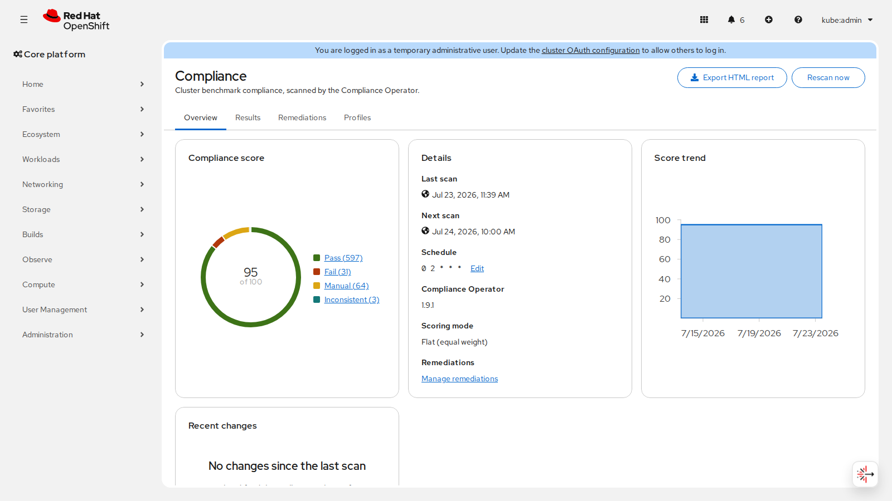
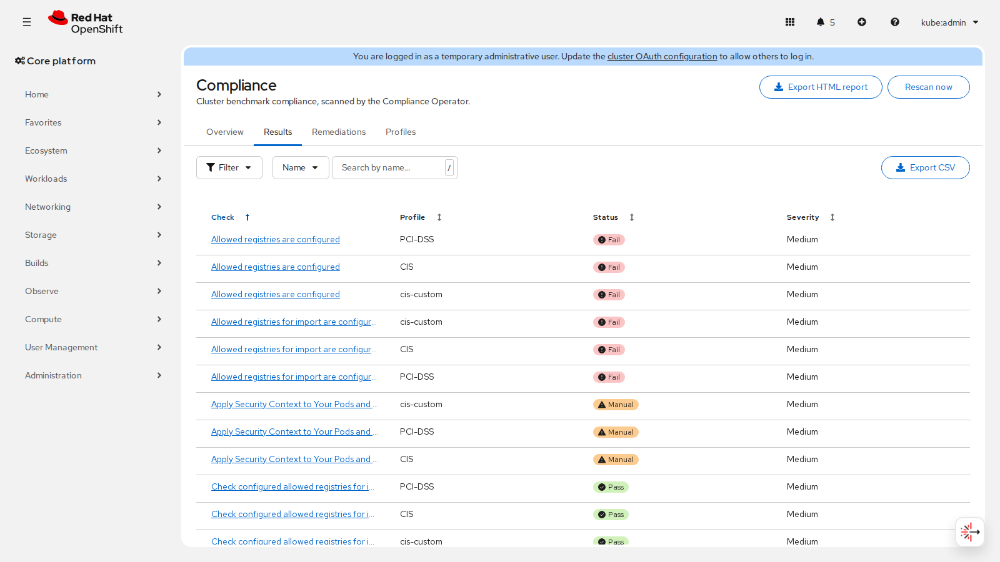
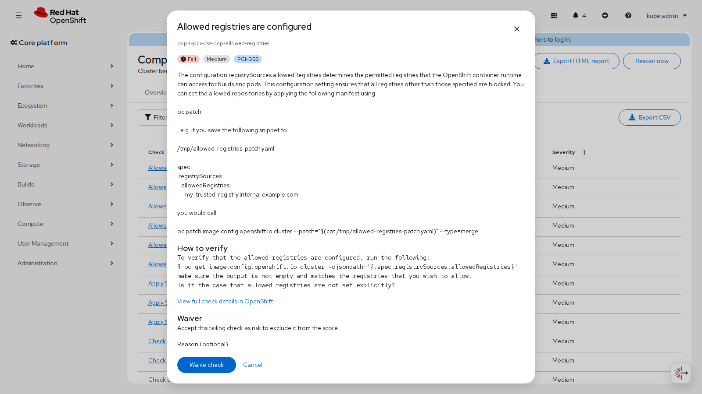
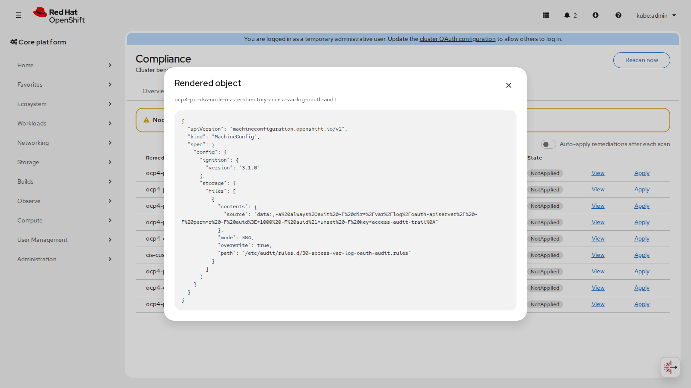
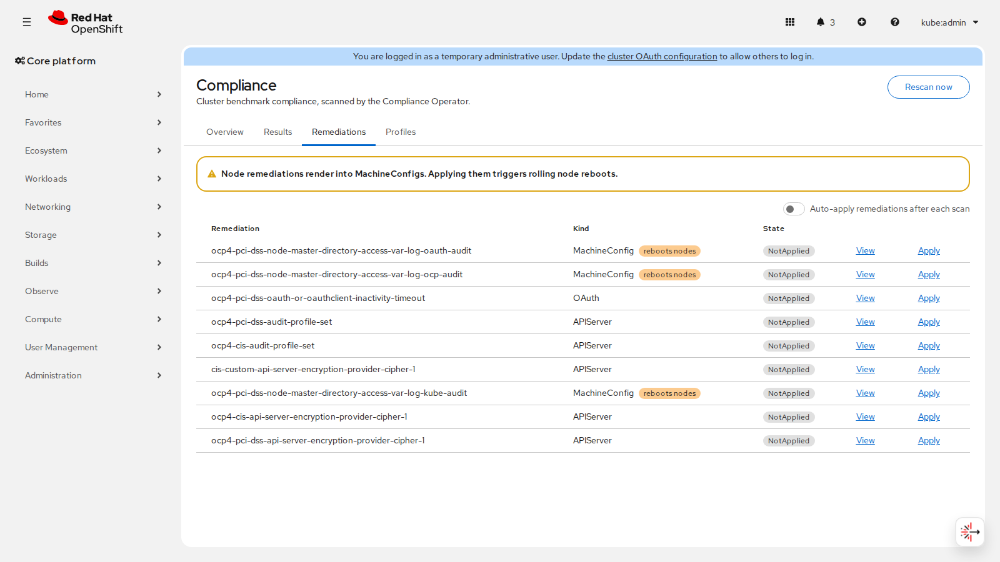
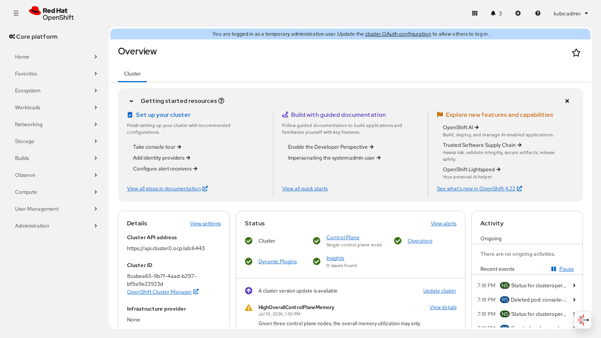

# OpenShift Baseline Security

Baseline compliance scanning for a single OpenShift cluster, built on the
Red Hat Compliance Operator, with results in the admin console.

Install it and the cluster benchmarks itself against the CIS OpenShift
Benchmark out of the box, rendered natively in the console under
**Administration → Compliance**.

**Current release: 0.5.5** (OLM channel `alpha`, API `baselinesecurity.openshift.io/v1alpha1`).
Consumer-facing release notes and upgrade notes: [CHANGELOG.md](CHANGELOG.md).
Work on `main` that is not yet cut lives under CHANGELOG **[Unreleased]** and is
not part of the published 0.5.5 CSV/image tags until the next version bump
(`make verify-versions` keeps those tags aligned with **Current release**).

## Features

Feature list describes the tree on `main` (published **Current release** plus
anything still under CHANGELOG **[Unreleased]** until the next version cut).
Install from published OLM image/CSV tags for only the released surface.

- **Zero-config baseline**: installing the operator scans the cluster against
  CIS on a daily schedule; no YAML required.
- **Profile catalog**: CIS, PCI-DSS, NIST 800-53 moderate/high, DISA STIG,
  NERC CIP, ACSC Essential Eight, BSI, selectable per profile. Bind your own
  Compliance Operator `TailoredProfile`s via `spec.tailoredProfiles`, or
  author them from the console.
- **Console UI**: compliance score (composition donut), per-profile score
  badges and history, filterable check results with detail + deep-link to the
  raw resource, CSV and printable HTML report export, score trend, editable
  schedule, next/last scan times.
- **Waivers & scan diff**: accepted-risk waivers (`spec.waivers` with expiry)
  excluded from the score; Overview surfaces `status.newlyFailed` /
  `status.fixed` since the previous scan.
- **Scoring**: default flat PASS/(PASS+FAIL); optional
  `spec.scoring.mode: SeverityWeighted`. Benign Compliance Operator
  INCONSISTENT results (PASS where applicable, NOT-APPLICABLE elsewhere)
  count as PASS.
- **Remediations**: gated apply with a confirmation modal, node-remediation
  (MachineConfig) warnings and MachineConfigPool-paused batch apply, rendered
  object view, and an auto-apply switch.
- **Status & conditions**: OpenShift-style Available / Progressing / Degraded
  rollups, per-profile counts, score history, `relatedObjects`.
- **Observability**: Prometheus metrics
  (`baseline_security_compliance_score`, `baseline_security_checks`,
  `baseline_security_status_observed_timestamp_seconds` for HA scrape
  selection, `baseline_security_remediation_batch_active`,
  `baseline_security_remediation_batch_started_timestamp_seconds` for
  MCP-paused batch age, `baseline_security_last_scan_timestamp_seconds`,
  `baseline_security_newly_failed`,
  `baseline_security_condition` for Available/Progressing/Degraded) with
  PrometheusRule alerts (`ComplianceScoreLow`, `ComplianceChecksFailing`,
  `ComplianceChecksInError`, `ComplianceChecksInconsistent`,
  `ComplianceStatusStale`, `ComplianceScanStale`, `ComplianceRegressions`,
  `RemediationBatchStuck`, `ClusterBaselineDegraded`);
  native Observe →
  Dashboards ConfigMap scraped by cluster (platform) monitoring.
- **Support**: `operator/hack/must-gather.sh` collects operator + compliance state.

## Layout

- `CHANGELOG.md`: consumer-facing release notes and migration notes
- `SECURITY.md`: supported versions and vulnerability reporting
- `docs/SPEC.md`: design specification (read this first)
- `docs/DESIGN-DECISIONS.md`: ADR-style product design tradeoffs
- `docs/PATTERNS.md`: OpenShift addon patterns this repo follows
- `docs/STANDARDS.md`: coding standards reference with authoritative links
- `docs/TEST-PLAN.md`: unit/e2e coverage catalog, run ledger, and tiers
- `operator/`: Go operator (kubebuilder go/v4) reconciling the
  `ClusterBaseline` CRD: installs/adopts the Compliance Operator, owns
  ScanSetting/ScanSettingBinding defaults, deploys the console plugin,
  aggregates score + history into status
- `console-plugin/`: console dynamic plugin (React 18, PatternFly 6,
  dynamic-plugin-sdk 4.22)

## Screenshots

Live against a single-node OpenShift 4.22 cluster (all generated by the
Playwright suite, `docs/screenshots/`).

Overview with a built-in and a tailored profile: composition donut, score
trend, next scan, per-profile score cards.



Filterable check results with a detail modal that links to the raw resource:




Remediations: rendered-object view and gated apply:




Compliance score deep-linked on the cluster Overview Details card:



## Prerequisites

- OpenShift 4.22
- A default StorageClass (scan results are stored on a PVC; without one,
  scans hang and the operator reports a `Degraded` condition)
- Cluster access to an OLM catalog carrying `compliance-operator`
  (`redhat-operators` by default)

## Install (OLM)

Build and push the operator image, console-plugin image, OLM bundle, and
file-based catalog (four images; tag them with the release version, never
reuse a published tag), then:

```sh
# Plugin image (must match CSV relatedImages / RELATED_IMAGE_CONSOLE_PLUGIN).
# Makefile pins DOCKER_BUILD_FLAGS (reproducible digests; same as operator).
make -C console-plugin docker-build docker-push IMG=<PLUGIN_IMG>
cd operator
make docker-build docker-push          # operator image (IMG=...)
make bundle bundle-build bundle-push   # validated OLM bundle
make catalog-build catalog-push        # file-based catalog
oc apply -f - <<EOF
apiVersion: operators.coreos.com/v1alpha1
kind: CatalogSource
metadata:
  name: baseline-security
  namespace: openshift-marketplace
spec:
  displayName: Baseline Security
  sourceType: grpc
  image: <CATALOG_IMG>
EOF
```

Then install "Baseline Security" from OperatorHub into the
`openshift-baseline-security` namespace using the cluster-wide
`AllNamespaces` install mode. The operator default-creates a
`ClusterBaseline/cluster` with the CIS profile and starts scanning; opt out
with `BASELINE_SECURITY_SKIP_DEFAULT_CR=true` on the CSV deployment.

Metrics: the OLM bundle ships ServiceMonitor, PrometheusRule, and a metrics
scrape ServiceAccount bound to ClusterRole `baseline-security-metrics-reader`
(`GET /metrics`). Non-OLM `make deploy` applies the same objects via
`operator/config/default` (includes `config/prometheus/`). The install
namespace is openshift-* (platform-reserved), so it carries the
`openshift.io/cluster-monitoring: "true"` label and platform Prometheus scrapes
it; user-workload monitoring never scrapes openshift-* namespaces. Monitoring
CRDs are required on the cluster (present on OpenShift).

Deleting the `ClusterBaseline` (or uninstalling this operator) does **not**
remove the Compliance Operator Subscription; CO is treated as a shared
cluster component. The console plugin and owned ScanSetting/bindings are
cleaned up via owner references and the finalizer.

Never reuse bundle/catalog image tags between pushes; OLM and kubelet caches
will serve the stale content. Bump the version (CSV, images, catalog entry)
for every publish.

## Versioning and upgrades

- **SemVer 0.x + alpha**: the product is pre-1.0. The CRD is `v1alpha1`, the
  OLM channel and CSV `maturity` are `alpha`. Breaking behavior may appear in
  minor releases; read [CHANGELOG.md](CHANGELOG.md) **Changed** / **Removed**
  and **Migration notes** before upgrading.
- **Consumer contract**: versioning covers the `ClusterBaseline` user-facing
  API, shipped metrics/alerts, the OLM `alpha` channel `replaces` edge, and
  the console plugin surface. Scan-diff bookkeeping fields
  (`status.previousFailures`, `diffBaseFailures`, `diffBaseScanTime`) are
  internal and may change in 0.x; details in [CHANGELOG.md](CHANGELOG.md).
- **Supported host**: OpenShift 4.22 only (`com.redhat.openshift.versions: =v4.22`;
  a bare `v4.22` would advertise 4.22 *and later*, which is untested). CSV
  `minKubeVersion` is `1.35.0` (the kube API floor for that OCP line). The
  console plugin pins `@console/pluginAPI` to `>=4.22.0-0 <4.23.0-0` for the
  same reason.
- **Support window**: only the latest published 0.x release is supported for
  bugfixes and security updates. Older 0.x lines get no backports; upgrade to
  the latest 0.x. Published CSV/image tags are immutable (never re-push the
  same version string with different bits). Security reporting:
  [SECURITY.md](SECURITY.md).
- **Install path**: OLM bundle + file-based catalog is the only supported
  install. Helm was removed in 0.4.0.
- **Notable 0.4.0 behavior change**: benign Compliance Operator `INCONSISTENT`
  results (PASS where applicable, NOT-APPLICABLE elsewhere) now count as PASS
  in score, metrics, and UI. Scores can rise on upgrade without remediations.
- **0.5.0 (breaking)**: API group renamed `baselinesecurity.io` →
  `baselinesecurity.openshift.io` (existing `ClusterBaseline` CRs must be
  recreated; see Migration notes). Also in 0.5.0: empty `spec.profiles: []`
  disables scanning; `spec.complianceCatalogSource` is DNS-1123-validated; OKD
  catalog auto-detection (`community-operators` when `redhat-operators` is
  absent); a `registry.ci.openshift.org` build variant (`Dockerfile.ci` +
  `.ci-operator.yaml`); scan-diff tracks raw FAIL (waivers no longer clear
  `newlyFailed` / invent `fixed`); status list-types for
  conditions/profiles/tailoredProfiles are map-merge; HA-safe score/fail alert
  expressions; metrics
  `baseline_security_status_observed_timestamp_seconds` /
  `baseline_security_remediation_batch_active` /
  `baseline_security_condition` /
  `baseline_security_last_scan_timestamp_seconds` /
  `baseline_security_newly_failed` /
  `baseline_security_remediation_batch_started_timestamp_seconds`; alerts
  `ComplianceChecksInError` / `ComplianceChecksInconsistent` /
  `ComplianceStatusStale` / `RemediationBatchStuck` / `ClusterBaselineDegraded` /
  `ComplianceScanStale` / `ComplianceRegressions`; dynamic informer watch on
  Compliance CRs. Details and migration notes: [CHANGELOG.md](CHANGELOG.md)
  **[0.5.0]**.
- **Version sources** (must stay equal; `make verify-versions` checks them):
  `operator/Makefile` (`VERSION`), the CSV in
  `operator/bundle/manifests/baseline-security-operator.clusterserviceversion.yaml`
  (name, version, containerImage, relatedImages),
  `console-plugin/package.json` (`version` + `consolePlugin.version`),
  `operator/catalog/package.yaml` channel entry (name) when present,
  `CHANGELOG.md` (`## [VERSION]`, `## [Unreleased]`, and the `[VERSION]:` /
  `[Unreleased]:` compare footers), this README's **Current release** line, and
  the Go toolchain lockstep between `go.mod`, the release `Dockerfile`,
  `Dockerfile.ci`, and `.ci-operator.yaml` (plus Node between `.nvmrc` and the
  console Dockerfile). No OLM `replaces` upgrade graph is maintained: this is
  pre-release with no installed base, so each build is a standalone channel head.
- **Cutting a release**: bump `VERSION`, CSV name/version/images, console-plugin
  versions, move CHANGELOG `[Unreleased]` into `## [VERSION]` with footer compare
  links (`[VERSION]: ...compare/vPREV...vVERSION` and
  `[Unreleased]: ...compare/vVERSION...HEAD`), update **Current release**, create
  an immutable git tag `vVERSION` pointing at that commit (CHANGELOG compare URLs
  require it; never force-move a published tag), then run
  `make verify-versions`, then publish **new** image tags only (never overwrite
  an existing version tag). Keep the CSV `links` Changelog entry pointed at
  `CHANGELOG.md` so consumers can find release notes.

## Development

```sh
# operator: build, unit test, lint, run against the current kubeconfig
# (Makefile pins GOTOOLCHAIN to match go.mod; needs Go 1.25+ or auto-download.)
cd operator && make test && make lint && make install && make run

# console plugin (Node 22 per .nvmrc / package.json engines; Yarn 4 via corepack)
cd console-plugin
corepack enable
yarn install --immutable
yarn lint && yarn typecheck && yarn test && yarn build
# against a live console: yarn start (serves on :9001)
```

`make run` needs `RELATED_IMAGE_CONSOLE_PLUGIN` pointing at a plugin image
the cluster can pull.

## Testing

- Unit + fuzz (Go): `cd operator && make test`.
- Unit (TypeScript): `cd console-plugin && yarn test`.
- E2E, live cluster (Go): `cd operator && make test-e2e` with `KUBECONFIG`
  set. Asserts the ClusterBaseline reaches `Available` with a score and
  healthy conditions, the owned ScanSetting/bindings and console plugin
  objects exist and are registered, and a profile add/prune round-trips.
- E2E, live console (Playwright): `cd console-plugin && yarn test-e2e` with
  `CONSOLE_URL` and `KUBEADMIN_PASSWORD` set (see
  `console-plugin/.env.example`; a local `.env` is loaded automatically).
  Drives every tab and doubles as the screenshot generator
  (`SCREENSHOT_DIR` defaults to `docs/screenshots`).

Targets OpenShift 4.22. License: Apache-2.0.
