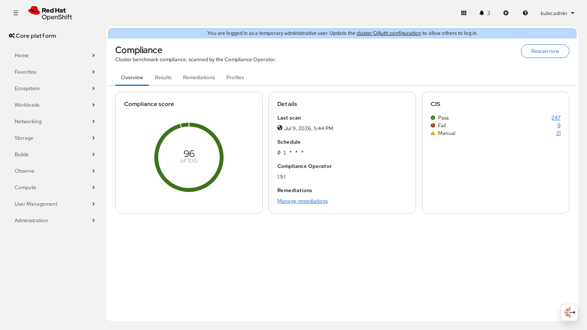
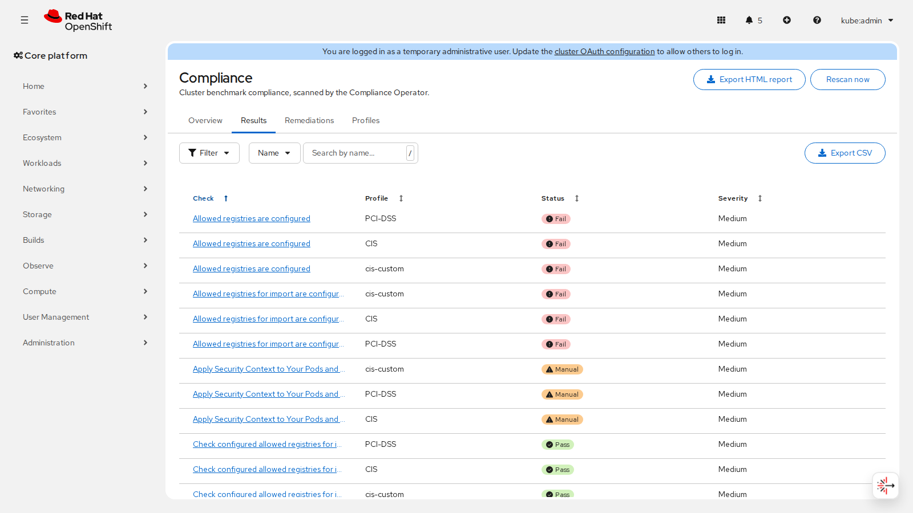
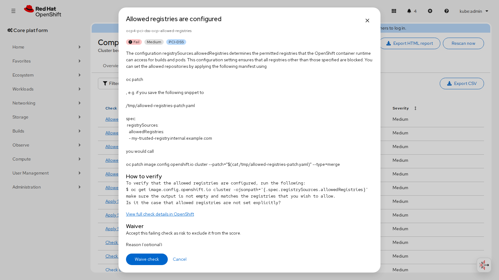
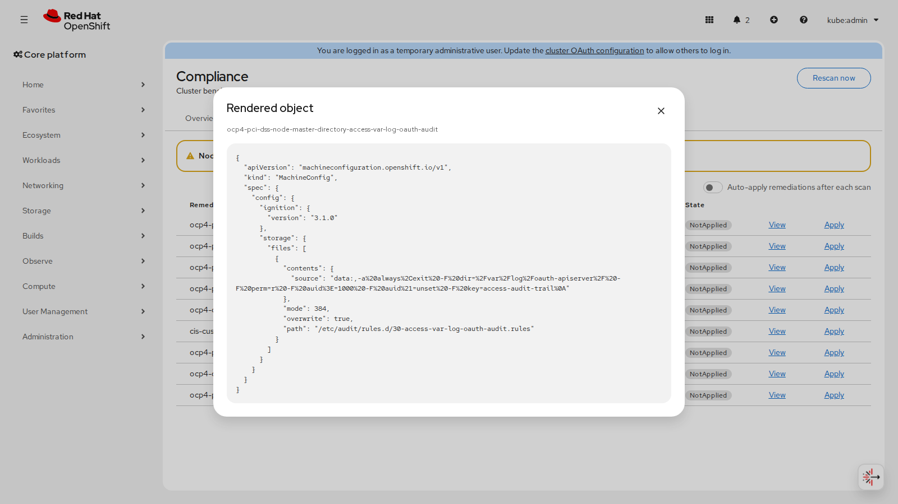
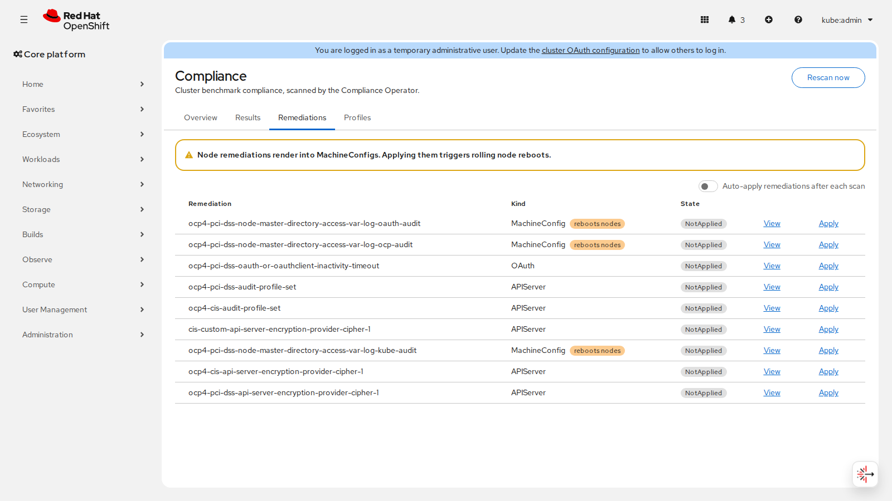
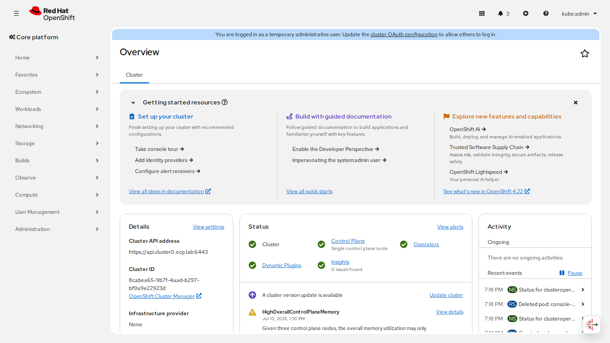

# OpenShift Baseline Security

Baseline compliance scanning for a single OpenShift cluster, built on the
Red Hat Compliance Operator, with results in the admin console.

Install it and the cluster benchmarks itself against the CIS OpenShift
Benchmark out of the box, rendered natively in the console under
**Administration → Compliance**.

**Current release: 0.9.0** (OLM channel `alpha`, API `baselinesecurity.openshift.io/v1alpha1`).
Consumer-facing release notes and upgrade notes: [CHANGELOG.md](CHANGELOG.md).
Work on `main` that is not yet cut lives under CHANGELOG **[Unreleased]** and is
not part of the published 0.9.0 CSV/image tags until the next version bump
(`make verify-versions` keeps those tags aligned with **Current release**).

## Quickstart

One `oc apply` installs everything (catalog, operator group, subscription).
Needs cluster-admin on OpenShift 4.22 with a default StorageClass.

```sh
oc apply -f - <<EOF
apiVersion: v1
kind: Namespace
metadata:
  name: openshift-baseline-security
  labels:
    # Opt the namespace into platform monitoring so metrics/alerts are scraped.
    openshift.io/cluster-monitoring: "true"
---
apiVersion: operators.coreos.com/v1alpha1
kind: CatalogSource
metadata:
  name: baseline-security
  namespace: openshift-marketplace
spec:
  displayName: Baseline Security
  sourceType: grpc
  image: quay.io/openshift-baseline-security/baseline-security-operator-catalog:0.9.0
---
apiVersion: operators.coreos.com/v1
kind: OperatorGroup
metadata:
  name: baseline-security
  namespace: openshift-baseline-security
spec: {}   # no targetNamespaces = AllNamespaces install mode
---
apiVersion: operators.coreos.com/v1alpha1
kind: Subscription
metadata:
  name: baseline-security-operator
  namespace: openshift-baseline-security
spec:
  channel: alpha
  name: baseline-security-operator
  source: baseline-security
  sourceNamespace: openshift-marketplace
  installPlanApproval: Automatic
EOF
```

The operator creates a `ClusterBaseline/cluster`, scans against CIS, and
renders results under **Administration → Compliance**. Full options (pinning,
build-from-source) in [Install (OLM)](#install-olm) below.

## Features

Describes `main`; install from published OLM tags for only the released surface.

- **Zero-config baseline**: installing the operator scans the cluster against
  CIS on a daily schedule; no YAML required.
- **Profile catalog**: CIS, PCI-DSS, NIST 800-53 moderate/high, DISA STIG,
  NERC CIP, ACSC Essential Eight, BSI, selectable per profile. Bind your own
  Compliance Operator `TailoredProfile`s via `spec.tailoredProfiles`, or
  author them from the console.
- **Console UI**: compliance score (composition donut), per-profile score
  badges and history, filterable check results with detail + deep-link to the
  raw resource, CSV and printable HTML report export, score trend, editable
  schedule, next/last scan times.
- **Waivers & scan diff**: accepted-risk waivers (`spec.waivers` with expiry)
  excluded from the score; Overview surfaces `status.newlyFailed` /
  `status.fixed` since the previous scan.
- **Scoring**: default flat PASS/(PASS+FAIL); optional
  `spec.scoring.mode: SeverityWeighted`. Benign Compliance Operator
  INCONSISTENT results (PASS where applicable, NOT-APPLICABLE elsewhere)
  count as PASS.
- **Remediations**: gated apply with a confirmation modal, node-remediation
  (MachineConfig) warnings and MachineConfigPool-paused batch apply, rendered
  object view, and an auto-apply switch.
- **Status & conditions**: OpenShift-style Available / Progressing / Degraded
  rollups, per-profile counts, score history, `relatedObjects`.
- **Observability**: Prometheus metrics, PrometheusRule alerts, and a native
  Observe → Dashboards score trend, scraped by platform monitoring. Reference:
  [docs/OBSERVABILITY.md](docs/OBSERVABILITY.md).
- **Support**: `operator/hack/must-gather.sh` collects operator + compliance
  state (Secret objects and waiver `requestedBy`/`approvedBy` are omitted).
  `--help` prints usage; a partial collection exits 1. It and
  `hack/backup.sh` write into `./must-gather` and `./baseline-backup` by
  default; both are gitignored, because a backup is unredacted.

## Layout

- `CONTRIBUTING.md`: clone-to-PR commands (setup, single-test loop, `make ci` / `bun run ci`)
- `AGENTS.md`: contributor contract (gate, version lockstep, house rules);
  `operator/` and `console-plugin/` each carry their own
- `CHANGELOG.md`: consumer-facing release notes and migration notes
- `SECURITY.md`: supported versions and vulnerability reporting
- `docs/THREAT_MODEL.md`: attack surface, trust boundaries, ranked threats
- `docs/SPEC.md`: design specification (read this first)
- `docs/DESIGN-DECISIONS.md`: ADR-style product design tradeoffs
- `docs/PATTERNS.md`: OpenShift addon patterns this repo follows
- `docs/STANDARDS.md`: coding standards reference with authoritative links
- `docs/RESTORE.md`: backup and restore runbook for the `ClusterBaseline` and
  Compliance Operator state (`operator/hack/{backup,restore,verify-backup}.sh`)
- `docs/TEST-PLAN.md`: unit/e2e coverage catalog, run ledger, and tiers
- `docs/OBSERVABILITY.md`: Prometheus metrics and alert reference
- `operator/`: Go operator (kubebuilder go/v4) reconciling the
  `ClusterBaseline` CRD: installs/adopts the Compliance Operator, owns
  ScanSetting/ScanSettingBinding defaults, deploys the console plugin,
  aggregates score + history into status
- `console-plugin/`: console dynamic plugin (React 18, PatternFly 6,
  dynamic-plugin-sdk 4.22)

## Screenshots

Live against a single-node OpenShift 4.22 cluster (all generated by the
Playwright suite, `docs/screenshots/`).

Overview with a built-in and a tailored profile: composition donut, score
trend, next scan, per-profile score cards.



Filterable check results with a detail modal that links to the raw resource:




Remediations: rendered-object view and gated apply:




Compliance score deep-linked on the cluster Overview Details card:



## Prerequisites

- OpenShift 4.22
- A default StorageClass (scan results are stored on a PVC; without one,
  scans hang and the operator reports a `Degraded` condition)
- Cluster access to an OLM catalog carrying `compliance-operator`
  (`redhat-operators` by default)

Read-only console users inherit `baseline-security-viewer` through the
built-in `view` and `cluster-reader` ClusterRoles. Writes (profile toggle,
waivers, remediations, TailoredProfiles) need `cluster-admin` or a
ClusterRoleBinding to `baseline-security-admin`. That admin role is not
aggregated onto namespaced `admin`, so a project admin of
`openshift-compliance` cannot apply remediations.

## Install (OLM)

### From the published catalog (recommended)

Point a CatalogSource at the released file-based catalog on Quay; no local
build needed. Pin the release tag (here `0.9.0`) or use `latest`:

```sh
oc apply -f - <<EOF
apiVersion: operators.coreos.com/v1alpha1
kind: CatalogSource
metadata:
  name: baseline-security
  namespace: openshift-marketplace
spec:
  displayName: Baseline Security
  sourceType: grpc
  image: quay.io/openshift-baseline-security/baseline-security-operator-catalog:0.9.0
EOF
```

The catalog's package references the operator and console-plugin images by the
release tag, so OperatorHub pulls everything from
`quay.io/openshift-baseline-security/*`.

### From source

Build and push the operator image, console-plugin image, OLM bundle, and
file-based catalog (four images; tag them with the release version, never
reuse a published tag), then apply the same CatalogSource with `image:` set to
your `<CATALOG_IMG>`:

```sh
# Plugin image (must match CSV relatedImages / RELATED_IMAGE_CONSOLE_PLUGIN).
# Makefile pins DOCKER_BUILD_FLAGS (reproducible digests; same as operator).
make -C console-plugin docker-build docker-push IMG=<PLUGIN_IMG>
cd operator
make docker-build docker-push          # operator image (IMG=...)
make bundle bundle-build bundle-push   # validated OLM bundle
make catalog-build catalog-push        # file-based catalog
```

Then install "Baseline Security" from OperatorHub into the
`openshift-baseline-security` namespace using the cluster-wide
`AllNamespaces` install mode. The operator default-creates a
`ClusterBaseline/cluster` with the CIS profile and starts scanning; opt out
with `BASELINE_SECURITY_SKIP_DEFAULT_CR=true` on the CSV deployment
(unrecognized values fail process start; see
[Operator process configuration](#operator-process-configuration)).

The bundle ships the metrics ServiceMonitor / PrometheusRule (scraped by platform
monitoring) and the `prometheus-k8s` discovery Role. The Grafana dashboard is not
a manifest: the operator writes it from an embedded asset at reconcile time. A
default-deny ingress `NetworkPolicy` on the operator pods keeps the metrics port
open to `openshift-monitoring` and the service-ca namespaces only; see
[docs/OBSERVABILITY.md](docs/OBSERVABILITY.md). Deleting the `ClusterBaseline`
or uninstalling this operator does **not** remove the shared Compliance
Operator; owned resources are cleaned up via owner references and the
finalizer.

## Install (in-cluster build, no external registry)

For a dev cluster or lab (including disconnected), build both images from the
current source inside the cluster's own registry and install via kustomize (no
OLM, no quay/ghcr push). Requires cluster-admin and the OpenShift internal
image registry.

```sh
git clone https://github.com/maci0/openshift-baseline-security.git
cd openshift-baseline-security

oc new-project openshift-baseline-security

# One-time: binary Docker BuildConfigs + ImageStreams (Dockerfile at each
# context root). Re-runnable builds thereafter are just `oc start-build`.
oc new-build --binary --strategy=docker --name=baseline-security-operator \
  -n openshift-baseline-security
oc new-build --binary --strategy=docker --name=baseline-security-console-plugin \
  -n openshift-baseline-security

# Build the current tree in-cluster (uploads the dir as the build context).
oc start-build baseline-security-operator --from-dir=operator --follow \
  -n openshift-baseline-security
oc start-build baseline-security-console-plugin --from-dir=console-plugin --follow \
  -n openshift-baseline-security

# Install via kustomize, pointing image refs at the internal registry.
# make deploy applies config/default (CRD, RBAC, manager, prometheus) and
# drops the pre-0.5.7 operator PDB if present.
REG=image-registry.openshift-image-registry.svc:5000/openshift-baseline-security
make -C operator deploy \
  IMG="$REG/baseline-security-operator:latest" \
  PLUGIN_IMG="$REG/baseline-security-console-plugin:latest"
```

Rebuild to pick up code changes with another `oc start-build ... --from-dir`,
then roll the deployments (the `:latest` ref does not change, so pods do not
restart on their own):

```sh
oc -n openshift-baseline-security rollout restart \
  deploy/baseline-security-operator deploy/baseline-security-console-plugin
```

The operator default-creates `ClusterBaseline/cluster` and registers the
console plugin on `consoles.operator.openshift.io/cluster`; the same
monitoring objects as the OLM path ship via `config/prometheus/`. This path is
for development and labs; use the OLM install above for production.

## Versioning and upgrades

Pre-1.0 SemVer on a single `alpha` OLM channel; the CRD is `v1alpha1`.
Breaking behavior may land in minor releases, so read
[CHANGELOG.md](CHANGELOG.md) (**Changed** / **Removed** / **Migration notes**)
before moving to a newer bundle. Only the latest published 0.x is supported;
published image/CSV tags are immutable.

There is no OLM `replaces` graph. OperatorHub capability is **Basic Install**
(not Seamless Upgrades). To take a newer 0.x: point the CatalogSource at that
catalog tag (`:X.Y.Z`; do not reuse a published tag) and install the new
channel head. If a previous CSV remains installed, delete its Subscription
and CSV first; the CRD and `ClusterBaseline` objects stay. `make deploy`
applies over the previous kustomize tree (and drops the pre-0.5.7 operator
PDB).

- **Host**: OpenShift 4.22 only. Declared, not admission-enforced: the CSV
  carries `minKubeVersion: 1.35.0` and no `com.redhat.openshift.versions`
  label, and the plugin declares `@console/pluginAPI >=4.22.0-0 <4.23.0-0`.
- **Install**: OLM bundle + file-based catalog (or the in-cluster build above).
- **Release process and version-source lockstep**:
  [docs/PATTERNS.md](docs/PATTERNS.md) §2 (`make verify-versions` enforces it).
- **Security reporting**: [SECURITY.md](SECURITY.md).

## Operator process configuration

The manager reads flags and a small set of env vars at start, logs the
non-secret values (image refs as set/valid only), and exits 2 on an invalid
listen address, a relative `--metrics-cert-dir`, an empty health-probe
address, or unexpected positional arguments. An unrecognized
`BASELINE_SECURITY_SKIP_DEFAULT_CR` value exits 1. `--help` prints usage
on stdout; an unknown flag or an unexpected argument exits 2 with the
message and the usage text on stderr, so stdout stays clean for a caller
that captures it. `--version` prints the release version on stdout and
exits 0.

ClusterBaseline spec (profiles, schedule, scoring, remediations, waivers)
is the product config; see `operator/config/samples/` and the CRD.

| Knob | Default | Notes |
|---|---|---|
| `--metrics-bind-address` | `:8443` | `0` disables the endpoint |
| `--metrics-secure` | `true` | Forced true unless the bind is loopback or disabled |
| `--metrics-cert-dir` | `/var/run/metrics-certs` | Absolute path; empty falls back to self-signed |
| `--health-probe-bind-address` | `:8081` | Required; empty is fatal (Deployment probes `:8081`) |
| `--leader-elect` | `true` | The Deployment runs 2 replicas |
| `--version` | none | Print the release version and exit 0 |
| `--zap-devel` | `false` | Console debug logs; not for production |
| `--zap-encoder` | json (prod) / console (devel) | `json` or `console` |
| `--zap-log-level` | info (prod) / debug (devel) | `debug`, `info`, `error`, `panic`, or an integer verbosity |
| `--zap-stacktrace-level` | error (prod) / warn (devel) | `info`, `error`, or `panic` |
| `--kubeconfig` | client-go default | Explicit kubeconfig path; wins over `KUBECONFIG` |
| `RELATED_IMAGE_CONSOLE_PLUGIN` | unset | Plugin image the operator deploys; unset leaves `ImageMissing` |
| `BASELINE_SECURITY_SKIP_DEFAULT_CR` | unset (create CR) | skips the default CR when true, i.e. `true`/`1`/`yes`/`on`/`y`/`t`/`enable`/`enabled`; the matching false spellings (`false`/`0`/`no`/`off`/`n`/`f`/`disable`/`disabled`), like unset, create the CR; any other value exits 1 |
| `GOMEMLIMIT` | `440MiB` in the Deployment | Go GC soft cap (not read by operator code) |

`make run` sets `--leader-elect=false --metrics-bind-address=0` and fills
`RELATED_IMAGE_CONSOLE_PLUGIN` from `PLUGIN_IMG` when the env is unset.

## Development

Commands from a clean clone through a first PR: [CONTRIBUTING.md](CONTRIBUTING.md).
`make help` at the repo root lists the repo-level targets; `make check`
reports a missing tool before a build starts, and `make -C operator help` /
`make -C console-plugin help` list the per-module targets.

```sh
# operator: unit test + lint. Makefile sets GOTOOLCHAIN from go.mod (1.26.x);
# host Go 1.21+ downloads that toolchain. `make ci` is the GHA operator job
# (needs docker for alert tests and bundle validate).
cd operator && make test lint verify

# console plugin (bun, version pinned by packageManager in package.json)
cd console-plugin
bun install --frozen-lockfile
bun run lint && bun run lint:oxlint && bun run typecheck && bun run test
# bun run ci also runs the production webpack build (matches GHA)
# against a live console: bun run start (serves on :9001)
# one file: bun run test src/scoring.test.ts   watch: bun run test:watch
```

`make run` needs `RELATED_IMAGE_CONSOLE_PLUGIN` pointing at a plugin image
the cluster can pull, and `oc` against the current kubeconfig (`make install`
applies the CRD first).

## Testing

- Unit + fuzz (Go): `cd operator && make test`. One package or one test:
  `cd operator && make test-one PKG=./internal/controller/ [RUN=TestName]`,
  which runs with the same exported toolchain, module and locale environment
  `make test` uses.
- Static consistency (CSV, RBAC, monitoring bundle, version lockstep, CRD
  shape, kustomize render): `cd operator && make verify`. No docker; it is the
  docker-free half of `make bundle`.
- Unit (TypeScript): `cd console-plugin && bun run test`. One file:
  `cd console-plugin && bun run test src/scoring.test.ts`. Watch: `bun run test:watch`.
- Full GHA replica: `make ci` at the repo root (needs docker), which is
  `cd operator && make ci` plus `cd console-plugin && bun run ci`.
- E2E, live cluster (Go): `cd operator && make test-e2e` with `KUBECONFIG`
  set. Asserts the ClusterBaseline reaches `Available` with a score and
  healthy conditions, the owned ScanSetting/bindings and console plugin
  objects exist and are registered, and a profile add/prune round-trips.
- E2E, live console (Playwright): `cd console-plugin && bun run test-e2e` with
  `CONSOLE_URL` and `KUBEADMIN_PASSWORD` set (see
  `console-plugin/.env.example`; a local `.env` is loaded automatically).
  Drives every tab and doubles as the screenshot generator
  (`SCREENSHOT_DIR` defaults to `docs/screenshots`).

Targets OpenShift 4.22. License: Apache-2.0.
