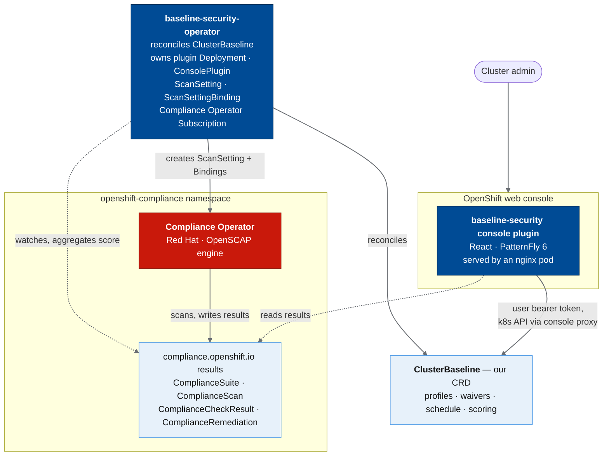

# OpenShift Baseline Security

Design specification for the product on `main` (0.4.x line plus work still under
CHANGELOG **[Unreleased]**). Targets OpenShift Container Platform 4.22. What is
in a published CSV/image tag is defined only by [CHANGELOG.md](../CHANGELOG.md)
and the **Current release** line in the root README; do not assume every
behavior here is in the last cut.

## 1. Summary

OpenShift Baseline Security is an OLM operator plus an admin-console dynamic
plugin that gives every OpenShift cluster an out-of-the-box compliance
baseline: install it, and the cluster continuously benchmarks itself against
the CIS OpenShift Benchmark (and optionally PCI-DSS, NIST 800-53, DISA STIG,
and the other profiles Red Hat already ships), with results rendered natively
in the OpenShift web console.

It does not implement a scanner. The scan engine is the Red Hat
**Compliance Operator** (OpenSCAP + ComplianceAsCode content), which is
included with every OpenShift subscription at no extra cost. What is missing
today, and what this project adds, is:

1. **Zero-configuration onboarding**: one CR (or just installing the operator)
   gets you a scheduled CIS scan with sane defaults. Today users must learn
   ProfileBundle/ScanSetting/ScanSettingBinding YAML first.
2. **A console UI**: today there is no compliance UI in the OpenShift console
   at all. Results are CLI-only (`oc get compliancecheckresults`) unless you
   buy Red Hat Advanced Cluster Security, whose compliance UI is the paid
   answer. This project is effectively the single-cluster, baseline slice of
   ACS compliance, built into the cluster console.

## 2. Motivation and landscape

Facts established from current (2026-07) Red Hat sources:

| Fact | Source |
|---|---|
| Compliance Operator is free with all OCP versions; ACS is a separate paid SKU | redhat.com blog "A guide to OpenShift Compliance Operator best practices" |
| Compliance Operator (verified on-cluster 1.9.1; content evolves via the catalog), upstream `github.com/ComplianceAsCode/compliance-operator`, ships via `redhat-operators` OLM catalog, channel `stable`, namespace `openshift-compliance` | GitHub releases, live e2e on OCP 4.22 |
| No compliance UI in the OpenShift console; no official console plugin exists; results consumption is CLI-first or via ACS | OpenShift docs, openshift org survey |
| ACS 4.8 "Schedules and Coverage" (compliance v2) is GA and is Red Hat's official graphical compliance answer; it drives the same Compliance Operator on secured clusters | RHACS 4.8 release notes |
| Console dynamic plugins are the sanctioned console extension mechanism (used by ODF, monitoring, netobserv, kubevirt) | openshift/enhancements dynamic-plugins |

Gap: a cluster admin without an ACS subscription has no graphical way to
answer "is this cluster CIS-compliant?". The engine and the content are
already on the cluster (or one Subscription away); only orchestration
defaults and presentation are missing. Both are cheap. That is this project.

## 3. Goals and non-goals

### Goals (v1)

- G1: Single-action enablement of baseline scanning: installing the operator
  and creating one `ClusterBaseline` CR (a default is offered) yields a
  scheduled `ocp4-cis` + `ocp4-cis-node` scan.
- G2: Profile selection: expose the full Red Hat profile catalog
  (CIS, PCI-DSS, NIST 800-53 moderate/high, DISA STIG, NERC CIP, ACSC E8,
  BSI) as a checkbox list, not YAML.
- G3: Console UI (admin perspective): compliance dashboard (score, composition
  donut by result status, per-profile status, score trend), filterable
  check-result list with rule detail (description, instructions, severity),
  scan status and "rescan now".
- G4: Compliance Operator lifecycle: install it automatically if absent,
  adopt it if present, never fight an existing installation.
- G5: Ship as an OLM bundle installable from a catalog source; repo layout
  and build conventions match openshift org components so productization is
  a re-namespace, not a rewrite.

### Stretch goals (implemented)

- S1: **Remediation apply from the UI**: one-click `spec.apply: true` on a
  `ComplianceRemediation`, with an explicit warning that node remediations
  render into MachineConfigs and reboot nodes; "auto-apply" toggle mapping
  to `ScanSetting.autoApplyRemediations`. Batch apply pauses affected
  MachineConfigPools so node remediations reboot once (annotation-driven
  `baselinesecurity.openshift.io/batch-apply` + `status.remediationBatch`).
- S2: **Trend and score history**: persist per-scan score snapshots
  (operator writes a compact history into the `ClusterBaseline` status,
  oldest first, capped at 30; optional per-profile history) and render a
  trendline on the dashboard. A native console dashboard ConfigMap under
  Observe → Dashboards exposes the Prometheus score series when UWM is on.

### Non-goals

- No scanner, no benchmark content authoring. Content is
  ComplianceAsCode, consumed as the content images Red Hat builds.
- No multi-cluster / fleet view. That is ACS and ACM territory. This is
  deliberately "this cluster" only.
- No vulnerability (CVE) scanning. Different problem, different tooling
  (Quay/Clair, ACS).
- No CustomRule/CEL authoring UI (Compliance Operator CustomRule is Tech
  Preview). TailoredProfile create/edit/bind from the console is in scope
  (select/disable existing content rules; not free-form CEL).

## 4. Architecture

Two deliverables, one repo (split-ready, see §9):



### 4.1 Operator (`baseline-security-operator`)

Go, kubebuilder go/v4 layout (operator-sdk CLI is deprecated by Red Hat;
kubebuilder is the current scaffolder, OLM bundle targets kept in the
Makefile). Runs in namespace `openshift-baseline-security` (suggested).

Responsibilities:

1. **Compliance Operator lifecycle** (G4). On reconcile of `ClusterBaseline`:
   - If the `compliance-operator` CSV is present in any namespace: adopt,
     record version in status, touch nothing of its config.
   - If absent and `spec.installComplianceOperator: Automatic` (default;
     string enum `Automatic`|`Manual`, not a boolean): create
     `openshift-compliance` Namespace, OperatorGroup, and a Subscription to
     package `compliance-operator`, channel `stable`, in the
     `redhat-operators` catalog (catalog source name configurable for
     disconnected/OKD clusters, where the ghcr.io upstream catalog is used).
   - An OLM bundle `dependencies.yaml` on the compliance-operator package is
     deliberately NOT used: OLM v0 resolves dependencies into the dependent's
     namespace/OperatorGroup, but compliance-operator expects its own
     namespace. Explicit Subscription reconciliation is the reliable path.
     Revisit when OLM v1 lands.
2. **Baseline defaults** (G1, G2). Own a `ScanSetting`
   (`baseline`, schedule from `spec.schedule`, default `0 1 * * *`, 1Gi PV,
   rotation 3) and one `ScanSettingBinding` per selected profile set (and
   tailored profile), mapping the CR's profile keys to real Profile names
   (`cis` → `ocp4-cis` + `ocp4-cis-node`, `stig` → `ocp4-stig` +
   `ocp4-stig-node` + `rhcos4-stig`, etc.). An empty `spec.profiles` with
   no `spec.tailoredProfiles` prunes all owned bindings and clears the score
   (scanning disabled; CR and history retained).
3. **Console plugin deployment** (G3): nginx Deployment (2 replicas with
   preferred pod anti-affinity; TLS on 9443, service-serving-cert mounted at
   `/var/serving-cert`), Service, `ConsolePlugin` CR in namespace
   `openshift-baseline-security` (created if missing), and registration on
   `consoles.operator.openshift.io/cluster` `spec.plugins` (removed on CR
   deletion via finalizer, or when `spec.console.managementState` is Removed).
4. **Status aggregation**: list `ComplianceCheckResult`s labeled with
   `compliance.openshift.io/suite=baseline-<profile>` (or
   `baseline-tp-<name>` for tailored bindings). Foreign CO suites are
   ignored. Aggregate into `ClusterBaseline.status`: per-profile (and
   tailored) pass/fail/manual/info/error/inconsistent/waived counts, a
   0-100 score (default flat pass/(pass+fail); optional
   `spec.scoring.mode: SeverityWeighted`; benign INCONSISTENT remapped
   to PASS/NOT-APPLICABLE first; residual INCONSISTENT plus MANUAL, INFO,
   ERROR, WAIVED, and NOT-APPLICABLE excluded; score cleared when
   there are no countable results), lastScanTime, nextScanTime, history
   (oldest first, capped at 30), newlyFailed/fixed since the previous
   scan, conditions (`Available` / `Progressing` / `Degraded` rollups
   plus detail: `ComplianceOperatorReady` from CSV phase Succeeded,
   `ScanConfigured`, `ScanStorageReady`, `ConsolePluginReady`; owned
   Pending PVCs set `ScanStorageReady` False and roll up to `Degraded`
   with reason `ScanStorageNotReady`). A lazy dynamic informer watches
   compliance CRs once their CRDs exist (event-driven reconcile); a
   poll requeue remains as fallback (1m steady, 15s while Progressing
   or a remediation batch is Applying; also shortens toward the soonest
   active waiver `expiresAt`, floored at 1s) until watches are up or if
   they fail. Owns the plugin Deployment/Service. Deleting
   ClusterBaseline does **not** uninstall the Compliance Operator.

### 4.2 API: `ClusterBaseline` CRD

Group `baselinesecurity.openshift.io/v1alpha1` (neutral OSS domain; productization
would move it under an openshift.io group). Cluster-scoped singleton named
`cluster`, enforced by CEL validation on metadata.name (openshift config CR
convention).

```yaml
apiVersion: baselinesecurity.openshift.io/v1alpha1
kind: ClusterBaseline
metadata:
  name: cluster
spec:
  profiles: [cis]              # enum keys: cis, pci-dss, nist-moderate,
                               # nist-high, stig, nerc-cip, e8, bsi;
                               # [] (and no tailoredProfiles) disables scanning
  tailoredProfiles: []         # names of TailoredProfiles in openshift-compliance
  schedule: "0 1 * * *"        # cron, passed to ScanSetting
  installComplianceOperator: Automatic # or Manual (string enum, not boolean)
  complianceCatalogSource: redhat-operators   # okd/disconnected override
  console:
    managementState: Managed         # or Removed
  remediation:
    apply: Manual                    # Automatic maps to ScanSetting autoApplyRemediations
  scoring:
    mode: Flat                       # or SeverityWeighted (see scoring note)
  waivers: []                        # accepted-risk exclusions from the score
status:
  conditions: [...]
  complianceOperatorVersion: 1.9.1
  lastScanTime: "2026-07-09T01:00:00Z"
  nextScanTime: "2026-07-10T01:00:00Z"
  score: 87                    # 0-100; see scoring note below
  profiles:
    - key: cis
      profileNames: [ocp4-cis, ocp4-cis-node]
      pass: 142
      fail: 21
      manual: 9
      info: 0
      error: 0
      inconsistent: 0
      waived: 0
      notApplicable: 3
      history: []              # per-profile snapshots, oldest first, max 30
  tailoredProfiles: []         # same count shape as profiles, keyed by name
  history: []                  # overall score ring, oldest first, max 30
  newlyFailed: []              # regressions vs previous completed scan
  fixed: []                    # improvements vs previous completed scan
  relatedObjects: []           # owned/driven resources for must-gather
  # remediationBatch: optional in-flight MCP-paused batch apply
  # previousFailures / diffBaseFailures / diffBaseScanTime: internal scan-diff
  # bookkeeping retained across reconciles (not user-facing knobs)
```

**Scoring note.** `status.score` is a single **pooled** ratio across every selected
profile and tailored binding (not the mean of per-profile scores). Default
`spec.scoring.mode: Flat` is `pass / (pass + fail) * 100` (integer floor).
`SeverityWeighted` multiplies each PASS/FAIL by a fixed severity weight before
that ratio: **high=10, medium=5, low=2, unknown/info/missing=1**. Before scoring,
benign Compliance Operator `INCONSISTENT` results (PASS where the check applies,
NOT-APPLICABLE elsewhere) collapse to PASS or NOT-APPLICABLE; only a genuine
PASS-vs-FAIL/ERROR node split stays INCONSISTENT. Residual INCONSISTENT, plus
MANUAL, INFO, ERROR, WAIVED, and NOT-APPLICABLE, are excluded from the
denominator in both modes. Per-profile `status.profiles[].history` (and tailored)
uses the same mode as the headline score when each point is written. A
`spec.scoring.mode` flip updates `status.score` immediately but does not rewrite
completed history points under the new formula (late CheckResult refresh for the
same `lastScanTime` is gated on the mode that wrote those points). The next
completed scan under the new mode clears overall and per-profile history rings
and appends a fresh snapshot so charts never mix Flat and SeverityWeighted
values. Severity is read from the ComplianceCheckResult
`.severity` field, with the `compliance.openshift.io/check-severity` label as
fallback.

### 4.3 Console plugin (`baseline-security-console-plugin`)

Dynamic plugin per `openshift/console-plugin-template` (main / 4.22 line):
`@openshift-console/dynamic-plugin-sdk` 4.22-latest, React 18, PatternFly 6,
TypeScript 5.9, webpack 5 module federation, Yarn 4 (Berry), i18n namespace
`plugin__baseline-security-console-plugin`. **No backend**: all data comes
from the Kubernetes API through the console's proxy using
`useK8sWatchResource` against `compliance.openshift.io/v1alpha1` and
`baselinesecurity.openshift.io/v1alpha1` resources, with the logged-in user's own
token. RBAC therefore falls out for free: users see what their role allows
(see §6).

Extension points (exact SDK types):

| Extension | Type | Purpose |
|---|---|---|
| Nav item "Compliance" under Administration | `console.navigation/href` (`perspective: admin`, `section: administration`) | entry point |
| Page `/baseline-security` with HorizontalNav tabs | `console.page/route` | Overview (score, composition donut, trend, schedule, waivers, scan diff), Results, Remediations, Profiles |
| Results tab | (in-page) | virtualized ComplianceCheckResult table: filter by status/severity/profile; detail modal for description + instructions; suite-scoped to baseline bindings; CSV export |
| Profiles tab | (in-page) | catalog of shipped profiles with enable switches writing `ClusterBaseline.spec.profiles`; TailoredProfile create/edit/bind (`useAccessReview`) |
| Remediations tab | (in-page) | apply/unapply with confirmation; batch apply; auto-apply toggle; rendered-object view |
| Cluster overview details item | `console.dashboards/custom/overview/detail/item` | compliance score deep-link on the cluster Overview |

Behaviors that write to the cluster:

- **Rescan now**: set annotation `compliance.openshift.io/rescan` on each
  owned ComplianceScan to a fresh token (e.g. timestamp). The value must
  change on every click so a re-rescan is observed when the key already
  exists (empty string alone is not enough).
- **Profile toggle**: patch `ClusterBaseline.spec.profiles`.
- **Schedule edit**: patch `ClusterBaseline.spec.schedule` (5-field cron).
- **Scoring mode**: patch `ClusterBaseline.spec.scoring.mode`
  (`Flat` | `SeverityWeighted`).
- **Waivers**: add/remove entries on `ClusterBaseline.spec.waivers`.
- **TailoredProfile authoring**: create/patch TailoredProfiles in
  `openshift-compliance`, then bind via `spec.tailoredProfiles`.
- **Remediation apply**: patch `ComplianceRemediation.spec.apply`, behind a
  confirmation modal spelling out the MachineConfig/reboot blast radius.
- **Auto-apply toggle**: patch `ClusterBaseline.spec.remediation.apply`
  (`Automatic` maps to ScanSetting `autoApplyRemediations`).
- **Batch remediation apply**: set annotation
  `baselinesecurity.openshift.io/batch-apply` on `ClusterBaseline` (comma-separated
  remediation names); the operator pauses target MachineConfigPools, sets
  apply, then resumes.

Client-only (no API write): CSV export of filtered results and printable
HTML compliance report.

All writes go through the user's token; a read-only user gets disabled
buttons (SDK `useAccessReview`), not errors.

## 5. Reused vs built

| Piece | Reuse | Build |
|---|---|---|
| Scan engine | `registry.redhat.io/compliance/openshift-compliance-rhel8-operator` (upstream: `ghcr.io/complianceascode/compliance-operator`) | |
| Benchmark content | `registry.redhat.io/compliance/openshift-compliance-content-rhel8` (upstream: `ghcr.io/complianceascode/k8scontent`) | |
| OpenSCAP scanner image | `registry.redhat.io/compliance/openshift-compliance-openscap-rhel8` (upstream: `ghcr.io/complianceascode/openscap-ocp`) | |
| Scan scheduling, PV storage, result CRs, remediations | Compliance Operator CRDs | |
| Console framework, auth, RBAC, proxy | console dynamic-plugin SDK | |
| Plugin web server | `registry.access.redhat.com/ubi9/nginx-120` | |
| Operator base image | `registry.access.redhat.com/ubi9/ubi-micro` (build: ubi9 go-toolset) | |
| Orchestration + defaults + status aggregation | | `baseline-security-operator` (Go) |
| UI | | `baseline-security-console-plugin` (TS/React) |
| OLM packaging | | bundle + FBC catalog for both-in-one package |

Net-new code is a thin orchestration operator and one frontend. Everything
security-critical (checks, scanner, remediation content) stays Red Hat-built
and Red Hat-updated.

## 6. Security and RBAC

- Operator ClusterRole: get/list/watch Compliance Operator check results,
  scans, and suites; create/update/delete ScanSetting and ScanSettingBindings;
  patch ComplianceRemediations; get/list/patch/watch MachineConfigPools
  (batch pause/resume); create Namespace/OperatorGroup/Subscription (scoped
  by resourceNames where OLM allows); patch
  `consoles.operator.openshift.io/cluster`; full access to the owned CRD;
  Deployment/Service in its own namespace (console plugin); ConfigMaps for the
  Observe → Dashboards score-trend object in `openshift-config-managed`.
  No secrets access, no node access, no exec.
- Plugin: no service account of consequence (nginx serves static files);
  every API call is the user's own token via the console proxy.
- Aggregated ClusterRoles shipped for humans:
  `baseline-security-viewer` (read CRs + check results, bound via
  cluster-reader aggregation label) and `baseline-security-admin`
  (edit ClusterBaseline, annotate scans, and patch remediations).
- Remediation apply is the only dangerous write in the system and is
  confirmation-gated and RBAC-gated (user token + admin role + modal).
- Plugin loads no external sources, so the console default CSP applies
  unmodified (no ConsolePlugin contentSecurityPolicy entries needed).

## 7. Toolchain pins (OCP 4.22 line)

Verified against openshift release-4.22 branches (go.mod/package.json of
openshift/kubernetes, openshift/api, openshift/console, openshift/library-go,
ComplianceAsCode/compliance-operator master, and npm dist-tags).

| Tool | Version | Matches |
|---|---|---|
| Go | 1.25 | openshift 4.22 builder (`rhel-9-golang-1.25-openshift-4.22`); compliance-operator master is go 1.25.8 |
| Kubernetes | 1.35 (`k8s.io/*` v0.35.x) | OCP 4.22 kube level (4.21 = 1.34, 4.20 = 1.33) |
| controller-runtime | v0.23.3 | release-0.23 targets k8s 1.35; same pairing as compliance-operator master |
| dynamic-plugin-sdk | 4.22.0 (`4.22-latest` dist-tag) | console 4.22 (SDK major.minor == console version since 4.18) |
| React | ^18.3.1 | console 4.22 frontend |
| PatternFly | ~6.4.x | console 4.22 frontend |
| TypeScript | 5.9.3 | console 4.22 frontend |
| webpack | ^5.107.x | console-plugin-template main |
| Node (build image) | 22 (`ubi9/nodejs-22`) | console 4.22 build image stream |
| Yarn | 4.14 via corepack | console-plugin-template |
| Scaffold | kubebuilder go/v4 layout | operator-sdk CLI deprecated (last shipped in OCP 4.18); note operator-sdk v1.42.3 scaffolds still pin k8s 1.33, hence hand-pinned versions here |

## 8. Packaging and delivery

- **Images**: `quay.io/<org>/baseline-security-operator`,
  `quay.io/<org>/baseline-security-console-plugin`, both multi-stage UBI9
  builds, Dockerfiles at each component root (a `Dockerfile.rhel` variant
  using `registry.ci.openshift.org` builders is added at productization).
- **OLM**: one package `baseline-security-operator`; bundle carries the
  ClusterBaseline CRD, CSV (with `console.openshift.io` related-images for
  the plugin image via `RELATED_IMAGE_CONSOLE_PLUGIN` env, so disconnected
  mirroring works), OLM channel `alpha` (pre-1.0; `stable` is a later goal).
  File-based catalog (FBC) image for a CatalogSource; goal:
  community-operators submission once v1 is stable.
- **Install UX**: OperatorHub → install → operator default-creates
  `ClusterBaseline/cluster` (CIS) when none exists. Opt out with
  `BASELINE_SECURITY_SKIP_DEFAULT_CR=true` on the CSV deployment.

## 9. Repo layout

Monorepo during incubation, each half shaped exactly like its standalone
openshift counterpart so a later split into two repos (the org's dominant
pattern: plugin repos are always separate from operator repos) is `git mv`:

```
openshift-baseline-security/
├── docs/SPEC.md                    # this document
├── operator/                       # kubebuilder go/v4 shape
│   ├── api/v1alpha1/
│   ├── cmd/main.go
│   ├── internal/controller/
│   ├── config/{crd,rbac,manager,default,prometheus,samples}/
│   ├── bundle/                     # OLM bundle (generated)
│   ├── Dockerfile
│   ├── Makefile
│   └── go.mod
├── console-plugin/                 # console-plugin-template shape
│   ├── src/components/             # React tabs, BaselineContext, Overview item, UI feedback timing
│   ├── src/{models,utils,scoring,status,names,cron,dates,waivers,patches,links,results,remediation,report,profiles,download,errors}.*
│   │                               # domain modules; utils.ts is a re-export barrel for tests
│   ├── locales/en/
│   ├── e2e/                        # Playwright live-console suite
│   ├── console-extensions.json
│   ├── package.json
│   ├── webpack.config.ts
│   └── Dockerfile
├── docs/{SPEC,DESIGN-DECISIONS,PATTERNS,STANDARDS,TEST-PLAN}.md
├── CHANGELOG.md
├── SECURITY.md                     # support window + vulnerability reporting
├── TODO.md
├── OWNERS
└── LICENSE                         # Apache-2.0
```

CI at productization: `.ci-operator.yaml` + config in `openshift/release`
per docs.ci.openshift.org onboarding; until then GitHub Actions running the
same Makefile targets (`test`, `lint`, `docker-build`).

## 10. Roadmap

| Milestone | Content | Status |
|---|---|---|
| 0.1 | Operator: CO install/adopt + CIS default binding + status score. Plugin: dashboard + results list. | Done; verified e2e on SNO 4.22.0 (score 96 from 277 CIS results) |
| 0.2 | Full profile catalog (G2), rescan button, OLM bundle + catalog. | Done; OLM install path verified on-cluster. community-operators submission pending |
| 0.3 (S2) | Score history + trendline; tailored profiles; metrics/alerts. | Done (30-entry status ring + trend chart) |
| 0.4 (S1 + expand-compliance-features) | Remediation gated apply + MCP-paused batch; waivers; scan diff; severity-weighted score; schedule/report UI; TailoredProfile authoring; benign INCONSISTENT→PASS; Helm removed (OLM only). | Done; see CHANGELOG.md 0.4.0 |
| Post-0.4 (main / Unreleased) | Empty `spec.profiles: []` disables scanning; DNS-1123 `complianceCatalogSource`; raw-FAIL scan-diff; status list-type map-merge; HA-safe score/fail alerts; dynamic informer; post-0.4 metrics/alerts (see CHANGELOG **[Unreleased]**). | On `main`; not in published 0.4.0 tags |
| Productization | Rename API group to openshift.io namespace, Dockerfile.rhel + ci-operator onboarding, split repos, Red Hat enhancement proposal referencing this spec. | Open |

## 11. Prerequisites

- A default StorageClass. Compliance scans persist raw ARF results to a PVC
  (`ScanSetting.rawResultStorage`, 1Gi); without a default StorageClass the
  PVCs stay Pending and scans hang without any error from the Compliance
  Operator. The operator surfaces this as detail condition
  `ScanStorageReady` False (reason `ScanStoragePending`), which rolls up
  to `Degraded` with reason `ScanStorageNotReady`. Verified on SNO: LVM
  Storage (LVMS) on a spare disk is sufficient.
- Cluster reachability to an OLM catalog carrying `compliance-operator`
  (`redhat-operators` by default, `spec.complianceCatalogSource` to
  override for OKD/disconnected).

## 12. Open questions

Resolved during implementation:

- Default-create: implemented. The operator creates `ClusterBaseline/cluster`
  (CIS) on start when none exists; opt out with
  `BASELINE_SECURITY_SKIP_DEFAULT_CR=true`.
- Nav placement: "Compliance" at the top of the Administration section
  (`insertBefore` cluster-settings).
- MANUAL results: excluded from the score, surfaced as a separate count per
  profile and as a results filter.

Still open:

- OKD support: upstream catalog/content images differ (ghcr.io); the
  `complianceCatalogSource` knob covers the Subscription, content image
  override may also be needed.
